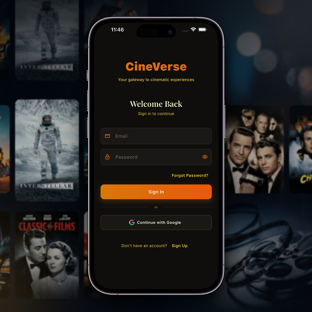
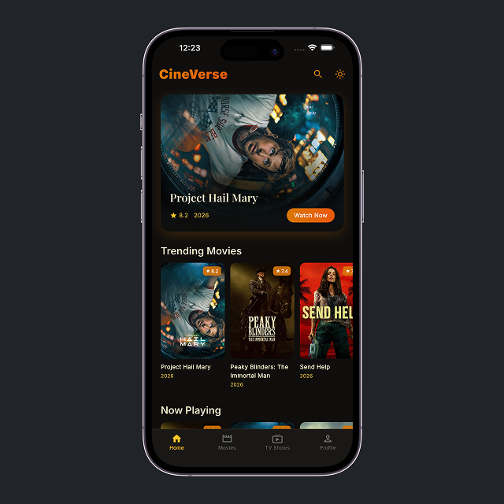
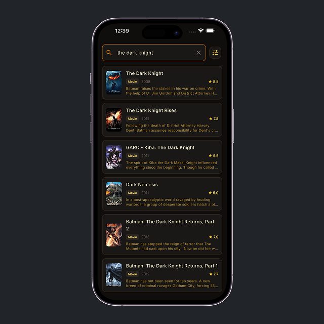
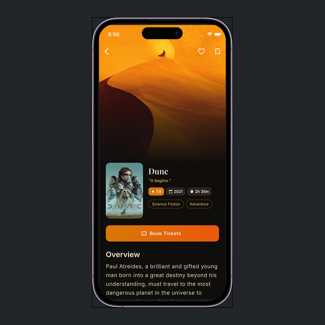
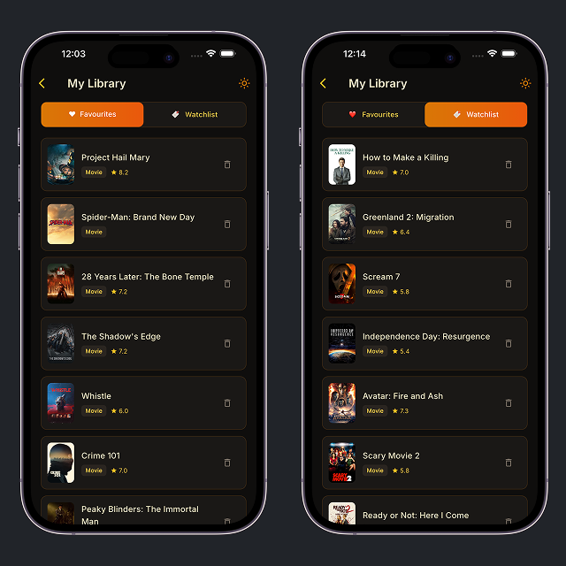
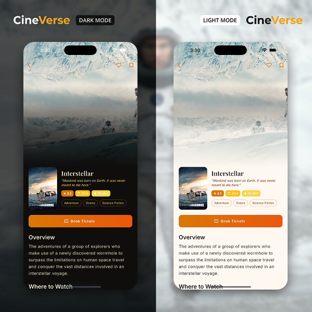

# 🎬 CineVerse - Cinematic Streaming Experience

[](https://flutter.dev)
[](https://riverpod.dev)
[](https://firebase.google.com)
[](https://opensource.org/licenses/MIT)

CineVerse is a premium, beautifully crafted movie and TV show discovery application built with **Flutter**. It offers a seamless, high-performance streaming-style experience, allowing users to explore trending titles, search for their favorites, and manage their watchlist with ease.

## ✨ Key Features

### 🔐 User Authentication
Seamlessly sign in or sign up to personalize your experience. CineVerse supports secure email/password authentication and Google Sign-In, powered by Firebase.



### 📺 Immersive Media Discovery
Explore a wide range of movies and TV shows trending globally. Our cinematic UI ensures titles are beautifully presented with high-quality posters and metadata.



### 🔍 Powerful Global Search
Find exactly what you are looking for. Our advanced search engine fetches results instantly across movies and TV shows from the TMDB database.



### 📽 Detailed Media Insights
Get in-depth details for every title, including ratings, synopses, cast information, trailer playback, and similar recommendations.



### ❤️ Favorites & Watchlist
Save your favorite movies and TV shows for quick access. Your favorites are synced across devices using Cloud Firestore.



### 🎨 Dynamic Dark & Light Modes
Personalize the app’s aesthetics to your preference. CineVerse features a premium design system that supports both dark and light modes with smooth transitions.



---

## 🛠 Tech Stack

CineVerse is built with modern, scalable, and high-performance technologies:

- **Frontend**: [Flutter](https://flutter.dev) (Dart)
- **State Management**: [Riverpod](https://riverpod.dev) for efficient reactivity and scalability.
- **Backend & Database**: [Firebase](https://firebase.google.com) (Auth, Firestore, Google Sign-In).
- **Networking**: [Dio](https://pub.dev/packages/dio) for robust API communication.
- **Theming**: [FlexColorScheme](https://pub.dev/packages/flex_color_scheme) for consistent and premium UI aesthetics.
- **UI Components**: [Glass Kit](https://pub.dev/packages/glass_kit) and [Cached Network Image](https://pub.dev/packages/cached_network_image) for professional visual polish.
- **Data Serialization**: [Freezed](https://pub.dev/packages/freezed) and [JSON Serializable](https://pub.dev/packages/json_serializable).

## 🏗 Project Architecture

CineVerse follows a **feature-based** clean architecture to ensure maintainability and modularity:

```text
lib/
├── core/         # Cross-cutting concerns (Theming, Providers, Env, Navigation)
├── features/     # Logic specific to features (Auth, Movies, TV shows, Favorites, Search)
│   ├── data/     # Repositories, Models & Data sources
│   ├── presentation/  # UI components & Riverpod controllers
│   └── domain/   # Business logic & Interface definitions
├── shared/       # Common widgets and utilities used across features
└── main.dart     # Entry point
```

---

## 🚀 Getting Started

Follow these steps to set up and run CineVerse locally.

### Prerequisites
- [Flutter SDK](https://docs.flutter.dev/get-started/install) installed (Stable channel)
- A [Firebase Project](https://console.firebase.google.com/) set up
- A [TMDB API Key](https://www.themoviedb.org/settings/api)

### 1. Clone the Repository
```bash
git clone https://github.com/ahsan-creates/cineverse.git
cd cineverse
```

### 2. Environment Variables
This project uses `envied` for secure API key management. Create a `.env` file in the root directory:
```bash
TMDB_API_KEY=your_api_key_here
TMDB_ACCESS_TOKEN=your_access_token_here
```
Then run the code generator:
```bash
flutter pub get
dart run build_runner build --delete-conflicting-outputs
```

### 3. Firebase Configuration
Ensure you have configured Firebase for Flutter. You can use the [FlutterFire CLI](https://firebase.google.com/docs/flutter/setup?platform=ios) to initialize your project:
```bash
flutterfire configure
```

### 4. Run the Application
```bash
flutter run
```

---

## 🤝 Contributing

We welcome contributions! If you'd like to help improve CineVerse, please follow these steps:

1. **Fork** the repository.
2. Create a new **branch** (`git checkout -b feature/AmazingFeature`).
3. **Commit** your changes (`git commit -m 'Add some AmazingFeature'`).
4. **Push** to the branch (`git push origin feature/AmazingFeature`).
5. Open a **Pull Request**.

---

## 📄 License

This project is licensed under the MIT License - see the [LICENSE](LICENSE) file for details.

---

<p align="center">Made with ❤️ by <b>Ahsan Khalil</b></p>
